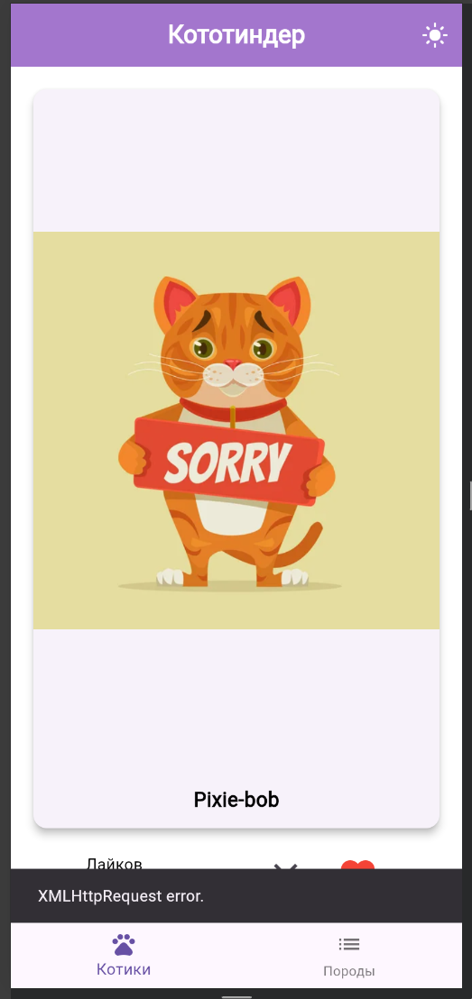
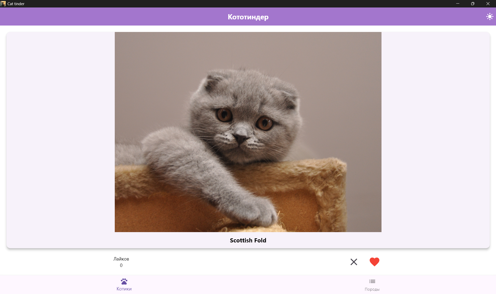
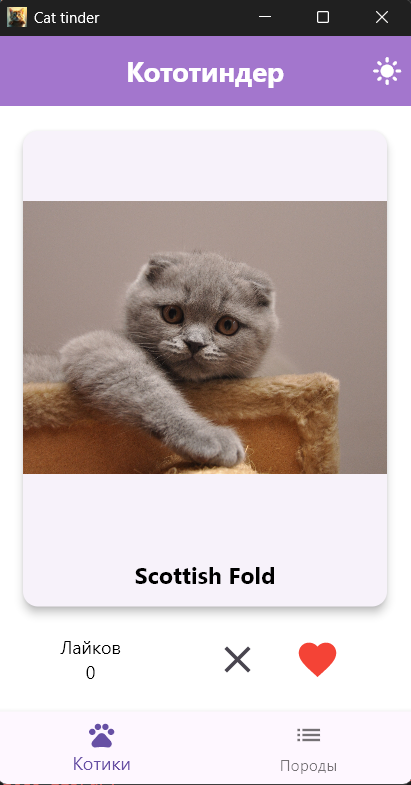

# ВШЭ, Flutter — Домашнее задание #1

## Demo

[Запись демонстрации приложения](docs/media/demo.mp4)

# Описание того что сделано

| **Все требования по домашнему заданию выполнены** |
|--|

**Описание дополнительного функционала и деталей реализации:**

## Визуальная часть
1. Поддержка светлой и тёмной темы.

   Когда пользователь заходит в приложение программа применяет тему "как в системе". Если пользователь ни разу не менял тему, то при изменении темы устройства, приложение применит новую тему автоматически. Когда пользователь меняет тему в приложении, данные записываются в `SharedPreferences` и применяются при следующих запусках. \
   [Пример использования тем, как в системе](docs/media/system-theme.mp4)

2. Для отображения картинок используется `CachedNetworkImage`
   
   При загрузке данных пользователю показывается анимация загрузки:
   

   Если при загрузке произошла ошибка, отображается соответствующая картинка и небольшое сообщение об ошибке.

    [ ссылка на картинку](docs/media/error-example.png) 
    
    *ошибка воспроизведена вручную \
    отдельно обрабатывается ошибка с кодом 429 `To Many Requests`

3. Все элементы корректно отображаются.

   3.1. Картинки. Свойство `fit = BoxFit.contain` \
   3.2. Прокрутка информации. Например, при просмотре всей информации о коте, где картинка имеет портретную ориентацию (для перехода надо нажать на картинку).

4. Загрузка данных о породах первый раз происходит непосредственно при переходе на соответствующий экран. При повторном переходе на экран, используются ранее загруженные данные. Для обновления списка пород необходимо потянуть пальцем вниз (`RefreshIndicator`).

5. Создана собственная иконка приложения в различных разрешениях.

   

   | Разрешение | Ссылка |
   |:--:|:--:|
   | 64x64 | [link](docs/media/icons/Icon-64.jpg) |
   | 128x128 | [link](docs/media/icons/Icon-128.jpg) |
   | 256x256 | [link](docs/media/icons/Icon-256.jpg) |
   | 512x512 | [link](docs/media/icons/Icon-512.jpg) |
   | 1024x1024 | [link](docs/media/icons/Icon-1024.jpg) |

## Реализация

1. Использование `SharedPreferences` для хранения информации о лайках и темы приложения для использования при следующих запусках.

2. Для асинхронной работы, где используется общая память используется `synchronized.Lock`.

3. Данные о котах подгружаются по 10 элементов, чтобы не нагружать устройство или вдруг вообще не хватит памяти, чтобы загрузить всех котов. Следующий запрос о котах осуществляется заблаговременно до долистования до последнего кота.

4. Для HTTP запросов используется `Dio`, так как ему можно задать параметры по умолчанию: `baseUrl` и `headers` с `x-api-key`.

5. Используется пакет `flutter_dotenv` для получения информации из файла `assets/.env`. В нём хранится адрес сервера `https://api.thecatapi.com`, а также там указывается `API_KEY` для лучшей версии API сервера (`API_KEY` хранится там, т.к. нет собственного сервера).

6. Качество кода.
   
   - Есть комментарии поясняющие блоки кода.
   - Есть документирующие комментарии (поля, методы, классы).
   - Код разбит по слоям: `presentation` и `service` — основные слои, `domain` и `repository` особо без кода 😊

7. Форматирование кода.

   | # | Команда | Логи | |
   |--|--|:--:|--|
   | 1 | `dart format .` | [logs](docs/logs/dart_format.log) | ✅ |
   | 2 | `flutter analyze` | [logs](docs/logs/dart_format.log) | ✅ |
   
   `analysis_options.yaml`:
   ```yml
   linter:
     rules:
       prefer_single_quotes: true
       avoid_init_to_null: true 
       empty_constructor_bodies: true
       avoid_print: true
       prefer_const_constructors: true
   ```

8. Сборка APK

   | # | Команда | Логи | |
   |--|--|:--:|--|
   | 1 | `flutter doctor` | [logs](docs/logs/flutter_doctor.log) | ✅ |
   | 2 | `flutter build apk --release` | [logs](docs/logs/flutter_build_apk.log) | ✅ |

   [apk файл](docs/apk/app-release.apk)

# Критерии по заданию.

## Функциональные требования
| # | Функциональные требования | |
|--|--|--|
| 1 | На главном экране отображается случайное изображение котика и название его породы | ✅ |
| 2 | Изображение котика можно свайпнуть или смахнуть влево или вправо, есть две кнопки: лайк/дизлайк | ✅ |
| 3 | Смахивание, свайп или нажатие на кнопку должно сменять котика на нового | ✅ |
| 4 | Если котика лайкнули (лайк или свайп вправо), то на экране должен увеличиваться счетчик | ✅ |
| 5 | Если нажать на само изображение котика, то должен открываться новый экран с детальным описанием | ✅ |
| 6 | На экране детального описания отображается то же изображение котика, плюс отображается вся информация про породу | ✅ |
| 7 | Реализован таб бар с переключением на экран “Список пород”, на котором отображается список доступных пород и краткая информация про них | ✅ |
| 8 | По тапу на породу открывается детальная информация про породу: описание и 3-4 характеристики | ✅ |

## Статический анализ кода
- Нет проблем с форматированием и линтером: Код отформатирован с помощь dart format, подключен и используется flutter_lints (в pubspec.yaml и analysis_options.yaml), Команда flutter analyze выполняется успешно без проблем ✅

## Технические требования
1. Использован пакет **`dio`** для запросов в API: https://thecatapi.com ✅
2. Использован виджет CachedNetworkImage для отображения картинок ✅ 
3. Сделана кастомная [иконка](docs/media/icons/Icon-1024.jpg) для приложения
[](docs/media/icons/Icon-1024.jpg)
✅

4. Ошибки, в первую очередь сетевые, обработаны – при их появлении показывается диалог с информацией о том, какая произошла ошибка ✅ \
   [ ссылка на картинку](docs/media/error-example.png) 

## PS

Позже получилось запустить приложение на Windows

[](docs/media/windows_1.png)
[](docs/media/windows_2.png)

